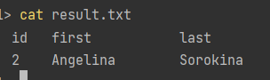

*Выполнила Галиева Г.Р. БСБО-05-19*
## Краткое писание
***
Для выполнения программы используются таблицы students и zachetka.

#### Таблица students:
| id | first_name | last_name | birthday|
|----|------------|-----------|---------|
| 0 | Alisa | Ivanova | 2002.03.03 |
| 1 | Igor | Volkov | 2001.12.31 |
| 2 | Angelina | Sorokina | 2002.05.24 |
| 3 | Kris | Islamova | 2001.06.24 |
| 4 | Arthur | Sultanov | 2002.01.09 |

#### Таблица zachetka:
| id  | student_id | subject | exam | professor | grade |
|-----|---|---------|------|-----------|-------|
| 0   | 0 | Math | 2021.01.11 | Ivanov I.I. | 5     |
| 1   | 0 | Lin. Al | 2021.01.15 | Ivanova A.A. | 4     |
| 2   | 0 | Software engineering | 2021.01.22 | Tarlanov M.M | 4     |
| 3   | 1 | Math | 2021.01.11 | Ivanov I.I. | 3     |
| 4   | 1 | Lin. Al | 2021.01.15 | Ivanova A.A. | 3     |
| 5   | 1 | Software engineering | 2021.01.22 | Tarlanov M.M | 3     |
| 6   | 2 | Math | 2021.01.11 | Ivanov I.I. | 5     |
| 7   | 2 | Lin. Al | 2021.01.15 | Ivanova A.A. | 5     |
| 8   | 2 | Software engineering | 2021.01.22 | Tarlanov M.M | 5     |
| 9   | 3 | Math | 2021.01.11 | Ivanov I.I. | 4     |
| 10  | 3 | Lin. Al | 2021.01.15 | Ivanova A.A. | 4     |
| 11  | 3 | Software engineering | 2021.01.22 | Tarlanov M.M | 4     |
| 12  | 4 | Math | 2021.01.11 | Ivanov I.I. | 3     |
| 13  | 4 | Lin. Al | 2021.01.15 | Ivanova A.A. | 3     |
| 14  | 4 | Software engineering | 2021.01.22 | Tarlanov M.M | 5     |

Инициализируется сервис с базой данных MySQL, и в него импортируются данные из файла `init.sql`. Сервис приложения делает запрос в сервис с данными.
Сборка проекта производится средствами CI, конфигурация указана в файле `.gitlab-ci.yml`. Ответ записывается в файл result.txt

#### Вывод программы
***
